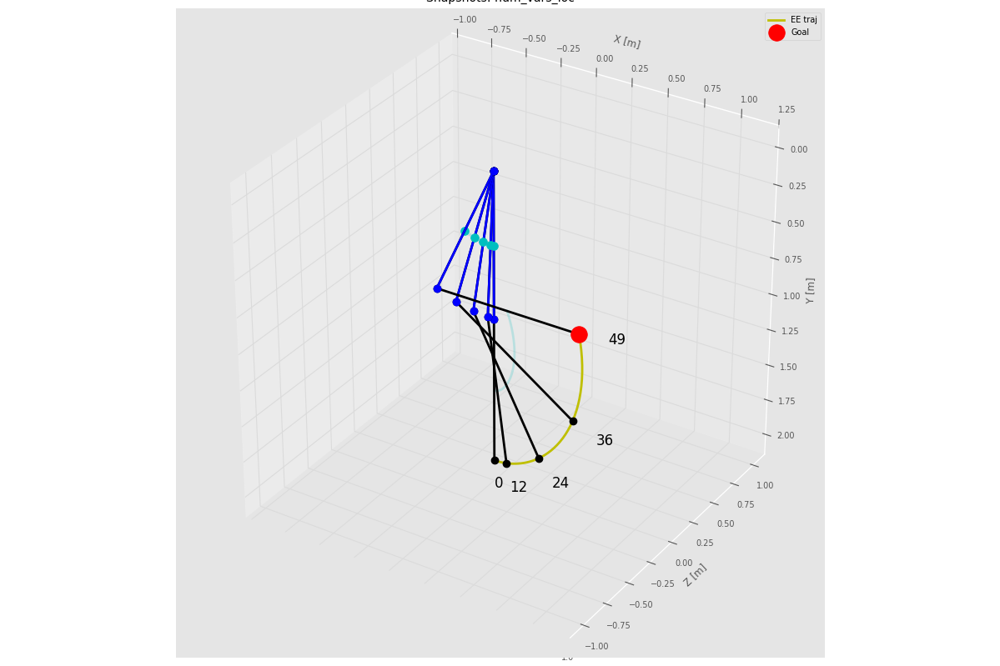
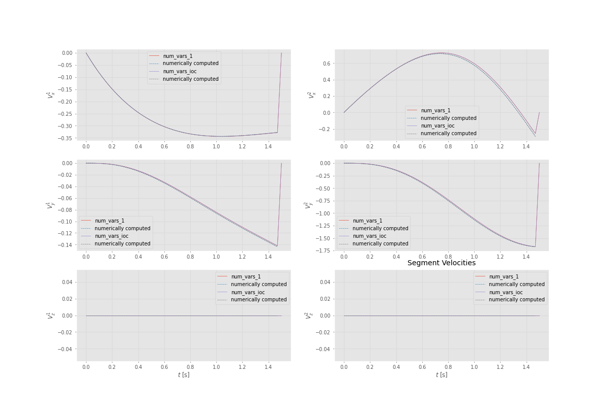

# 🦾 Reliability of Single-Level Equality-Constrained Inverse Optimal Control.

This repository contains a **Python implementation** of the modeling, trajectory optimization, and **inverse optimal control (IOC)** framework described in *Becanovic et al. (2024)*.  
It uses the [CasADi](https://web.casadi.org/) library for symbolic and numerical optimization, and visualizes results via Matplotlib.

This is a python translation from the original matlab code that can be found [here](https://github.com/Beca-Filip/ioc_planar). This repository is also trying to extend the method to 3 Dimension robots based on DH paramerters. 

The corresponding research article is : 
Filip Becanovic, Kosta Jovanović, Vincent Bonnet. Reliability of Single-Level Equality-Constrained Inverse Optimal Control. 2024 IEEE-RAS 23rd International Conference on Humanoid Robots (Humanoids), Nov 2024, Nancy, France. pp.623-630, 10.1109/Humanoids58906.2024.10769923. hal-04931691

---

## 📘 Overview

The project simulates an **N-degree-of-freedom (N-DOF)** planar robotic manipulator performing a trajectory optimization task and identifies underlying cost function weights via **inverse optimal control**.

The workflow includes:

1. **Forward Dynamics Modeling**
2. **Trajectory Optimization** via CasADi’s `Opti` interface 
3. **Inverse Optimal Control** (estimating cost weights from optimal trajectories)
4. **Visualization** of robot motion, joint trajectories, and segment velocities 

---

## 🧩 Repository Structure

The current working code in 2 dimensions is stored in `src/singlelevel_ioc/2Dimensions`

The extenstion to 3 dimensions (WIP) is stored in `src/singlelevel_ioc/3Dimensions`


---

## ⚙️ Dependencies

You will need the following Python packages:

```bash
pip install numpy matplotlib casadi scipy
```

or, you can simply call 
```bash
pixi install
```
in this directory's root and it will automatically install the correct versions of the dependencies for the project. Pixi documentation [here](https://pixi.sh/dev/installation/).

---

## 🚀 How to run ? 
In each directory (2Dimensions or 3Dimensions) there is a main script `Becanovic_2024.py` or `Becanovic_2024_3D.py` you can directly run theses files using python interpreter.  

Both files first generate an optimal motion linked to given weights for the cost function and then uses the computed trajectory to run Inverse Optimal Control and recover the weights. 

Plots:

- Robot snapshots during motion

- Joint trajectories (q, dq, ddq, and torque)

- Segment velocities


**In 2 dimensions :** 

Joint trajectories are plotted over time using `plot_joint_traj_from_vars()`.


*Figure: Joint positions (q), velocities (dq), accelerations (ddq), and torques (τ) plotted over the trajectory.*

Robot configuration throught the motion 


*Figure: 2 DoF robot arm snapshot.*

Estimated segment velocity along the motion : 


*Figure: Joints linear velocities.*


**In 3 dimensions (using a DH model):**

Joint trajectories are plotted over time using `plot_joint_traj_from_vars()`.


*Figure: Joint positions (q), velocities (dq), accelerations (ddq), and torques (τ) plotted over the trajectory.*

Robot configuration throught the motion 



*Figure: 2 DoF robot arm snapshot.*

Estimated segment velocity along the motion : 



*Figure: Joints linear velocities.*